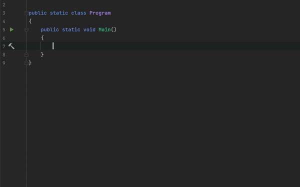

# Rider Guids

  

Generates in-place GUID instance inside C# code using Jetbrains Rider.

### Features

- Add Guid instance here (lowercase)
- Add Guid string here (lowercase)
- Add Guid instance here (uppercase)
- Add Guid string here (uppercase)

### Example of use

- Recall context action using `Alt + Enter`
- Choose desired `RiderGuids` option
- Enjoy

  

### How to install

#### Using marketplace (not yet released):

1. Go to `Settings` / `Plugins` / `Marketplace`
1. Search for "Rider Guids"
1. Click `Install`, then `Save`
1. After saving restart Rider

#### Using `.zip` file
1. Go to [**Releases**](https://github.com/kolosovpetro/RiderGuids/releases)
2. Download the latest release of plugin for your edition of JetBrains Rider
3. Proceed to `Settings` / `Plugins` / `⚙` / `Install plugin from disk`
4. Click `Save`
5. After saving restart Rider